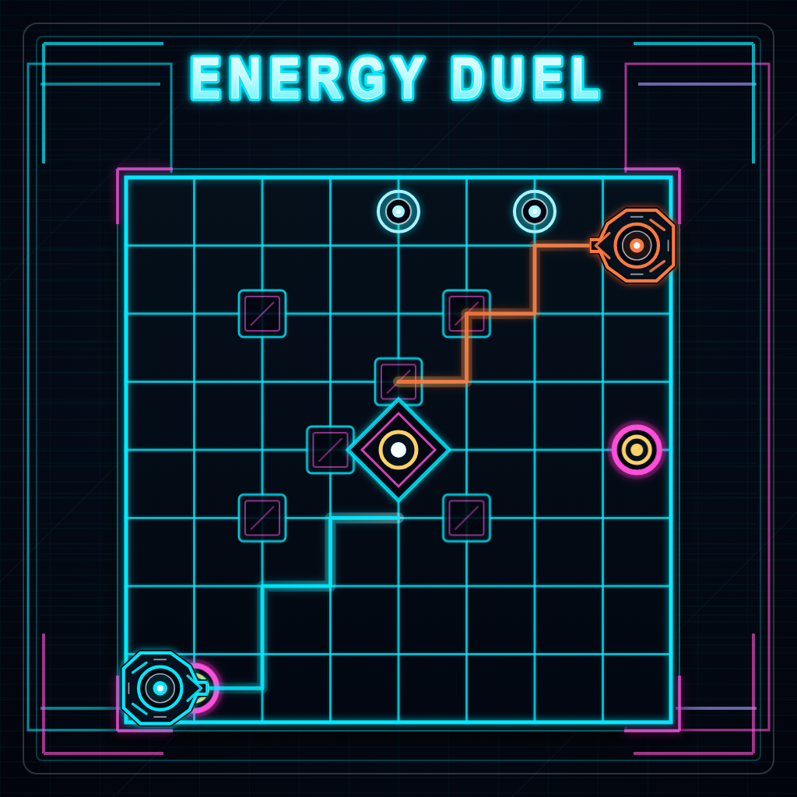

# Energy Duel



A neon, simultaneous turn-based strategy game built for **[Gamedev.js Jam 2026](https://gamedevjs.com/jam/2026/)** — theme: **Machines**.

## Play

- **Wavedash:** https://wavedash.com/games/energy-duel
- **Itch.io:** https://rorystandley.itch.io/energy-duel
- **Repository:** https://github.com/rorystandley/energy-duel

---

## What is it?

Energy Duel is a competitive 1v1 robot strategy game played on a neon grid.

You queue your moves. Your rival does the same. Then both machines execute simultaneously — no taking turns, no reaction time advantage. Pure strategy.

Collect energy nodes, dodge collisions, and outscore your opponent across 5 rounds.

---

## How to Play

| Action | Keys |
|---|---|
| Queue a move | Arrow keys / WASD |
| Execute moves | Space |

- Queue up to **8 moves** per round
- Both robots reveal and execute moves at the same time
- Collect **energy nodes** to score points
- Collisions cause a clash — positioning matters
- New blockers appear each round
- **Highest score after 5 rounds wins**

---

## Theme: Machines

Energy Duel interprets "Machines" through:

- Two competing autonomous robots on a digital grid
- Deterministic, mechanical simultaneous execution
- Energy collection as a resource system
- A Tron-inspired aesthetic — circuits, grids, neon

---

## Tech Stack

| Tool | Role |
|---|---|
| [Phaser 4](https://phaser.io) | Game framework |
| TypeScript | Language |
| Vite | Build tooling |
| Web Audio API | Procedural sound effects |
| [Wavedash](https://wavedash.com) | Game hosting & distribution |

---

## Jam Challenges

This entry participates in:

- **Phaser** — built entirely with Phaser 4
- **Open Source by GitHub** — MIT licensed, source on GitHub
- **Wavedash** — deployed and playable on Wavedash

---

## Running Locally

```bash
npm install
npm run dev
```

Open `http://localhost:5173`.

## Building

```bash
npm run build
```

Output goes to `dist/`.

## Tests

```bash
npm test
```

---

## Project Structure

```
src/
  main.ts          # Entry point, Phaser initialisation
  GameScene.ts     # All gameplay logic
  game/
    audio-manager.ts   # Music & SFX management
    constants.ts       # Shared game constants
public/
  audio/           # Background music
  branding/        # Cover art
```

---

## Audio

- **Background music** — generated with [Suno](https://suno.com)
- **Sound effects** — procedurally generated in code via the Web Audio API (no audio files)

---

## License

[MIT](LICENSE) — free to use, fork, and learn from.

---

## Credits

- **Game design & code** — Rory Standley
- **Music** — [Suno](https://suno.com)
- **Game framework** — [Phaser](https://phaser.io)
- **Hosting** — [Wavedash](https://wavedash.com)
